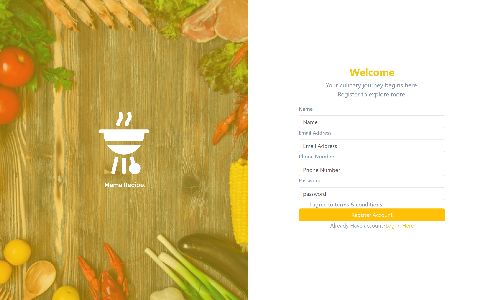
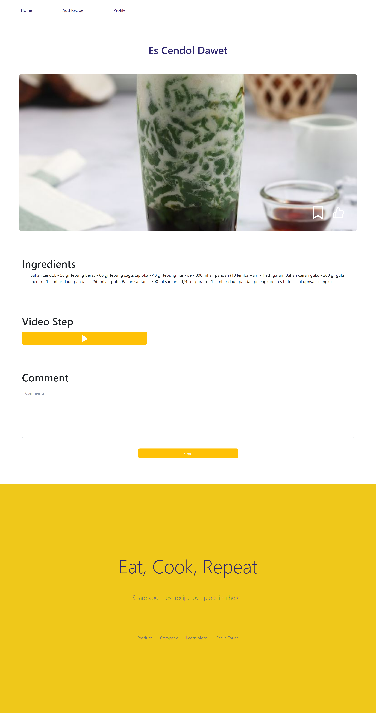

# Mama Recipe Frontend Documentation

This documentation provides a comprehensive guide to the frontend development of the Mama Recipe website. Here, you will find detailed information about the project's structure, components, and usage guidelines. Please read through this document carefully to gain insights into the Mama Recipe frontend.

## Table Of Content

- [Project Structure](#project-structure)
- [Description](#description)
- [Screenshots](#screenshots)
- [Built With](#built-with)
- [Usage](#usage)
- [Related Project](#related-project)
- [Contributing](#contributing)

---

## Project Structure

```plaintext
mama-recipe-frontend/
|-- public/
|   |-- index.html
|-- src/
|   |-- assets/
|   |   |-- icon/
|   |   |-- img/
|   |-- components/
|   |   |-- BgLeft/
|   |   |-- Button/
|   |   |-- Footer/
|   |   |-- Form/
|   |   |-- modalUpdate/
|   |   |-- Navigation/
|   |-- redux/
|   |   |-- reducers/
|   |   |-- store.js
|   |-- router/
|   |   |-- index.js
|   |-- views/
|   |   |-- AddRecipe/
|   |   |-- DetailRecipe/
|   |   |-- DetailVideo/
|   |   |-- Home/
|   |   |-- Login/
|   |   |-- Profile/
|   |   |-- Register/
|-- .gitignore
|-- package.json
|-- README.md

```

# Description

Mama Recipe is a website that allows users to share recipes and watch cooking tutorials through videos. Features of the Mama Recipe website and mobile apps include allowing users to create and share their own recipes. Users can also browse and view recipes shared by other users. The website displays cooking tutorials in the form of videos, providing easy-to-follow step-by-step guidance.

## Screenshots

<details>
  <summary>
    Login
  </summary>

</details>

<details>
  <summary>
    Register
  </summary>

</details>

<details>
  <summary>
    Landing Page
  </summary>

</details>

<details>
  <summary>
    Search Page
  </summary>

</details>

<details>
  <summary>
    Search Page Function
  </summary>

</details>

<details>
  <summary>
    Search Page Sorting
  </summary>

</details>

<details>
  <summary>
    Add Recipe
  </summary>

</details>

<details>
  <summary>
    Detail Recipe
  </summary>

</details>

<details>
  <summary>
    Detail Video
  </summary>

</details>

<details>
  <summary>
    Profile
  </summary>

</details>

<details>
  <summary>
    Profile My Recipe Section
  </summary>

</details>

## Built With

- **React JS**: Primary library for building dynamic and responsive user interface components.
- **React/Bootstrap**: UI framework for designing sleek and responsive user interfaces.
- **Axios**: Library used for making HTTP requests to the Mama Recipe backend server.
- **Redux**: State management library for managing the global state of the application.

## Usage

1. Ensure Node.js and npm are installed on your system.
2. Clone this repository to your local machine: `git clone <repository_URL.git>`
3. Navigate to the project directory: `cd mama-recipe-frontend`
4. Install project dependencies: `npm install`
5. Run the project locally: `npm start`
6. Access `http://localhost:3000` in your browser to view the Mama Recipe website.

## Related Project

- [Mama Recipe Backend](https://github.com/RamdlanFaqih/BE-Mama-Recipe) - Backend for Mama Recipe

## Contributing

We welcome contributions from the community. If you encounter bugs or wish to add new features, please create a pull request or issue in this repository. Your help is greatly appreciated!

Feel free to reach out if you have any questions or need further assistance. Thank you for your contribution to the Mama Recipe frontend development!
